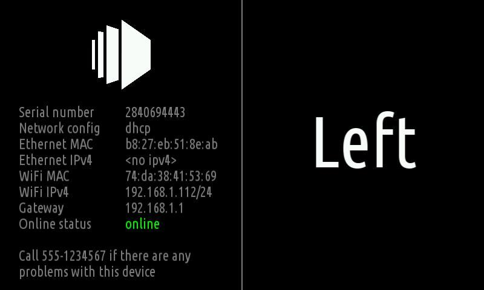

# Shows instructions and information that helps installing a device

This package enables you to ship devices to a customer and
have the device show useful information while setting the
device up.

Here is what the output might look like:

# Information provided

 * **Serial**: This is the serial number of your Pi that you can also see on the
   devices page. 

 * **Network config**: If the device uses a `static` or `dhcp` configuration.

 * **Ethernet IP/MAC addresses**

 * **WiFi IP/MAC addresses**

 * **Online status**: Shows if the device can reach the info-beamer
   hosted service.

# Similar packages

You can also have a look at the [Screen Info](https://info-beamer.com/pkg/1248) package.

# Questions / Feedback

Either visit the contact page or use the issue tracker
on https://github.com/info-beamer/package-installation-help/issues.
